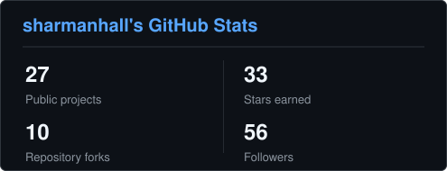
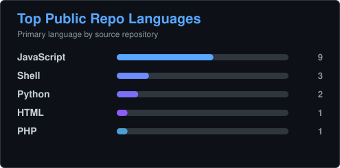
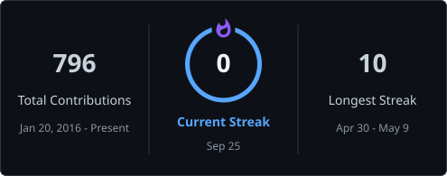

# sharmanhall

I build practical browser, macOS, WordPress, and AI-connected automation, with
an emphasis on local processing, inspectable outputs, and deliberate guardrails.

## Tech stack

### Languages

### Platforms and data

### Interfaces and delivery

## GitHub activity

<!-- markdownlint-disable MD033 -->

  

  

  

<!-- markdownlint-enable MD033 -->

Cards refresh daily from public GitHub data.

### Top contributions

<!-- markdownlint-disable MD033 -->

  

<!-- markdownlint-enable MD033 -->

## Selected work

- **[AI Site Connector][ai-site-connector]** — Connects AI coding tools to
  self-hosted WordPress with core Application Passwords, a conservative operator
  role, permission-gated REST and MCP tools, audit logging, tests, and release
  ZIP packaging.
- **[Open Chat Archiver][open-chat-archiver]** — Exports conversations already
  rendered in Facebook or Messenger to local JSON, CSV, TXT, or HTML files
  through a dependency-free Manifest V3 extension with scoped permissions and
  CI checks for disallowed network APIs.
- **[MacWhisper Transcription Automation][macwhisper]** — Sends Apple Notes call
  recordings through a macOS Shortcut to local MacWhisper or whisper.cpp
  transcription, saves timestamped job-folder transcripts, and returns
  Notes-ready plaintext.
- **[iMessage Unsent][imessage-unsent]** — For authorized analysis of your own
  Mac, snapshots Messages data and examines SQLite WAL evidence without writing
  to the live database; recovery is time-sensitive, best-effort, and subject to
  applicable law and consent.
- **[GMB OSINT][gmb-osint]** — Turns Google Search knowledge panels into a local
  workbench for business identifiers, useful links, and JSON, CSV, or Markdown
  exports without an API key or third-party calls.
- **[Spotify Multi-Account Switcher][spotify-switcher]** — Switches between saved
  local Spotify profile states on macOS using existing session data rather than
  storing account passwords. Saved profiles still contain session tokens and
  should be protected.

## Support my work

[ai-site-connector]: https://github.com/tyhallcsu/ai-site-connector
[gmb-osint]: https://github.com/tyhallcsu/gmb-osint
[imessage-unsent]: https://github.com/tyhallcsu/imessage-unsent
[macwhisper]: https://github.com/tyhallcsu/macwhisper-transcription-automation
[open-chat-archiver]: https://github.com/tyhallcsu/messages-saver-open-source
[spotify-switcher]: https://github.com/tyhallcsu/spotify-multi-account-switcher
